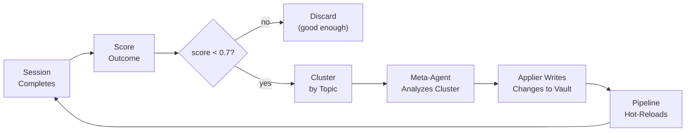
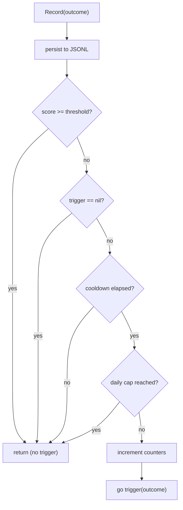
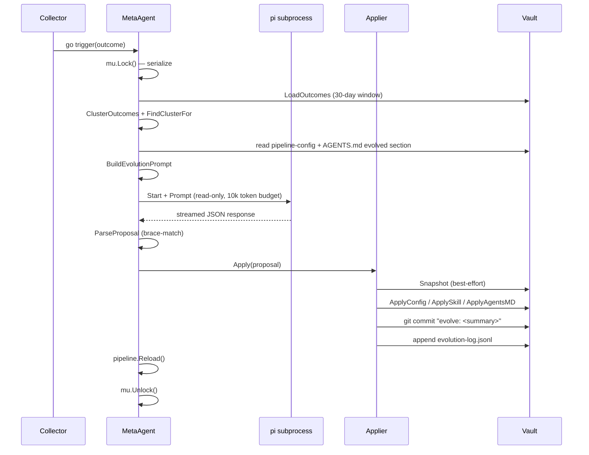

# MemEvolve Documentation Implementation Plan

> **For agentic workers:** REQUIRED: Use superpowers:subagent-driven-development (if subagents available) or superpowers:executing-plans to implement this plan. Steps use checkbox (`- [ ]`) syntax for tracking.

**Goal:** Create comprehensive documentation for MemEvolve — AgentLoop's self-evolving memory pipeline — as a new `memevolve/` section in the `agentloop-docs` Astro/Starlight site, with cross-links from existing pages.

**Architecture:** Seven new MDX pages in journey order (overview → pipeline → scoring → evolution loop → versioning → configuration → tutorial), plus sidebar wiring and two cross-link additions. All Go type signatures written verbatim from source. Dual-audience: operator summary at top of each page, developer deep-dive below.

**Tech Stack:** Astro 5.6.1, Starlight 0.37.6, MDX, astro-mermaid 1.3.1. Build: `npm run build` in `agentloop-docs/`. Callouts use `<Aside>` component from `@astrojs/starlight/components`. Diagrams use mermaid fenced blocks.

---

## File Structure

**New files (7):**
```
agentloop-docs/src/content/docs/memevolve/
├── overview.mdx
├── how-memory-works.mdx
├── scoring-and-triggers.mdx
├── evolution-loop.mdx
├── versioning-and-safety.mdx
├── configuration.mdx
└── custom-encoder.mdx
```

**Modified files (3):**
```
agentloop-docs/astro.config.mjs                                      — add sidebar section
agentloop-docs/src/content/docs/architecture/memory-system.mdx       — add tip callout at end
agentloop-docs/src/content/docs/reference/configuration-reference.mdx — add tip callout after Memory section
```

**Source of truth (read-only, in agentloop worktree):**
```
internal/memory/evolve/interfaces.go
internal/memory/evolve/pipeline.go
internal/memory/evolve/config.go
internal/memory/evolve/meta/agent.go
internal/memory/evolve/meta/applier.go
internal/memory/evolve/meta/prompt.go
internal/memory/evolve/meta/proposal.go
internal/memory/evolve/metrics/outcome.go
internal/memory/evolve/metrics/collector.go
internal/memory/evolve/metrics/cluster.go
internal/config/config.go
```

---

## Chunk 1: Foundation — Sidebar + Overview + Pipeline Page

### Task 1: Add MemEvolve sidebar section to `astro.config.mjs`

**Files:**
- Modify: `agentloop-docs/astro.config.mjs`

- [ ] **Step 1: Add MemEvolve sidebar section**

In `astro.config.mjs`, insert the following new section in the `sidebar` array, between the existing `Architecture` block and the `Guides` block (after line 55, before the `Guides` label):

```js
{
  label: "MemEvolve",
  badge: { text: "Self-Evolving", variant: "tip" },
  collapsed: false,
  items: [
    { label: "Overview", slug: "memevolve/overview" },
    { label: "The Memory Pipeline", slug: "memevolve/how-memory-works" },
    { label: "Scoring & Triggers", slug: "memevolve/scoring-and-triggers" },
    { label: "Evolution Loop", slug: "memevolve/evolution-loop" },
    {
      label: "Versioning & Safety",
      slug: "memevolve/versioning-and-safety",
    },
    { label: "Configuration", slug: "memevolve/configuration" },
    {
      label: "Tutorial: Custom Encoder",
      slug: "memevolve/custom-encoder",
    },
  ],
},
```

- [ ] **Step 2: Verify the config is valid**

```bash
cd agentloop-docs && npm run build 2>&1 | tail -20
```

Expected: build succeeds (exit 0). If it fails with "page not found" errors for `memevolve/*` slugs, that is expected at this stage — the pages don't exist yet. Any other error must be fixed before continuing.

- [ ] **Step 3: Commit**

```bash
cd agentloop-docs
git add astro.config.mjs
git commit -m "feat(docs): add MemEvolve sidebar section"
```

---

### Task 2: Write `memevolve/overview.mdx`

**Files:**
- Create: `agentloop-docs/src/content/docs/memevolve/overview.mdx`

- [ ] **Step 1: Create the file**

```bash
mkdir -p agentloop-docs/src/content/docs/memevolve
```

Write `agentloop-docs/src/content/docs/memevolve/overview.mdx` with this exact content:

```mdx
---
title: What Is MemEvolve?
description: MemEvolve is AgentLoop's self-evolving memory pipeline — it watches how tasks go and quietly improves memory retrieval over time without any manual tuning.
---

import { Aside } from '@astrojs/starlight/components';

## Overview

MemEvolve watches every completed session and scores its quality. When a session ends badly — too many human course-corrections, excessive tool calls, or outright errors — it analyzes what went wrong, proposes targeted improvements, and applies them automatically. Every change is snapshotted and git-committed so you can inspect, diff, or revert at any time.

<Aside type="tip">
MemEvolve is opt-in-by-default (`evolution.enabled: true`) but runs autonomously. You do not need to do anything to activate it. To disable it, set `evolution.enabled: false` in `agentloop.yaml`.
</Aside>

## The Four-Stage Feedback Loop

Each session completion feeds into a continuous improvement cycle:



The loop is **asynchronous** — it never blocks a session. It is **rate-limited** — a minimum cooldown and daily cap prevent runaway LLM costs. It is **serialized** — only one evolution runs at a time.

## What MemEvolve Can Change

All changes are scoped to the vault (`~/.local/share/agentloop/vault/`):

| Target | What changes | Where stored |
|--------|-------------|-------------|
| **Pipeline config** | Retrieval strategy, keyword limits, compaction, topic bonuses | `vault/memory/evolved/pipeline-config.yaml` |
| **Evolved skills** | New or updated `evolved-*` skills loaded into future prompts | `vault/skills/evolved-*/SKILL.md` |
| **Agent instructions** | Bullet points inside the `<!-- EVOLVED:START/END -->` markers in `AGENTS.md` | Agent's instruction file |

## What MemEvolve Cannot Change

These are hard boundaries enforced in code:

- Content in `AGENTS.md` **outside** the `<!-- EVOLVED:START -->` / `<!-- EVOLVED:END -->` markers
- Skills whose names do not start with `evolved-` (hand-authored skills are never touched)
- Security policies (`internal/security/`, TypeScript extensions)
- Core server configuration (`agentloop.yaml` fields outside `evolution:`)
- The `position: "edges"` retriever setting (always enforced, not overridable)

<Aside type="danger">
Do not remove the `<!-- EVOLVED:START -->` and `<!-- EVOLVED:END -->` markers from `AGENTS.md` manually. The Applier creates them on first evolution if absent — removing them causes subsequent patches to be appended to the file rather than merged in place.
</Aside>

## Key Guarantees

1. **Serialized** — `MetaAgent` holds a mutex for the full duration of each evolution. Concurrent triggers block and run sequentially.
2. **Rate-limited** — Minimum cooldown between runs (`min_cooldown_seconds: 300`) and a daily cap (`max_daily_runs: 10`). Both reset on server restart.
3. **Snapshot-before-apply** — A timestamped snapshot of the current config is attempted before any file is written (best-effort: a snapshot failure is logged but does not abort the evolution).
4. **Git-tracked** — Every evolution produces a `git commit` in the vault directory with message `evolve: <summary>`.
5. **Zero downtime** — Pipeline config is swapped atomically (`atomic.Pointer[Pipeline]`). In-flight sessions continue on the old pipeline; new sessions pick up the updated config immediately.
6. **Auditable** — Every run appends a line to `vault/memory/evolved/evolution-log.jsonl`.

<Aside type="tip">
See [Versioning & Safety](/memevolve/versioning-and-safety) for rollback procedures and the full audit trail structure.
</Aside>
```

- [ ] **Step 2: Verify it builds**

```bash
cd agentloop-docs && npm run build 2>&1 | grep -E "error|Error|overview"
```

Expected: no errors for `overview.mdx`. Fix any MDX syntax errors before continuing.

- [ ] **Step 3: Commit**

```bash
cd agentloop-docs
git add src/content/docs/memevolve/overview.mdx
git commit -m "docs(memevolve): add overview page"
```

---

### Task 3: Write `memevolve/how-memory-works.mdx`

**Files:**
- Create: `agentloop-docs/src/content/docs/memevolve/how-memory-works.mdx`

**Key source signatures** (copy verbatim, do not paraphrase):

```go
// From internal/memory/evolve/interfaces.go
type Encoder interface {
    Encode(ctx context.Context, input EncoderInput) (*EncoderOutput, error)
}
type Storer interface {
    Store(ctx context.Context, units []MemoryUnit) error
    Load(ctx context.Context, userId string, filter StoreFilter) ([]MemoryUnit, error)
}
type Retriever interface {
    Retrieve(ctx context.Context, query RetrievalQuery) (*RetrievalResult, error)
}
type Manager interface {
    Compact(ctx context.Context, input CompactionInput) (*CompactionResult, error)
}

type MemoryUnit struct {
    ID        string
    Timestamp time.Time
    Role      string            // "user", "assistant", "system"
    Content   string
    Keywords  []string
    Topics    []string
    Metadata  map[string]string // Extensible: contextID, source, toolsUsed, type
    Score     float64           // Set by Retriever during scoring
}

// From internal/memory/evolve/pipeline.go
func NewPipelineHolder(
    vaultPath string,
    defaults  *PipelineConfig,
    encoder   Encoder,
    storer    Storer,
    retriever Retriever,
    manager   Manager,
) *PipelineHolder

func (h *PipelineHolder) Get() *Pipeline
func (h *PipelineHolder) Reload() error
func (h *PipelineHolder) ConfigVersion() string
```

- [ ] **Step 1: Create the file**

Write `agentloop-docs/src/content/docs/memevolve/how-memory-works.mdx`:

```mdx
---
title: The Memory Pipeline
description: How AgentLoop builds the memory block for every prompt — the four interfaces, MemoryUnit exchange type, Pipeline orchestrator, baseline implementations, and hot-swap model.
---

import { Aside } from '@astrojs/starlight/components';

## Overview

Every agent prompt includes a `<memory>` block assembled by a four-stage pipeline: **encode** raw interactions into structured units → **store** them in the vault → **retrieve** relevant ones for the current task → **compact** under the token budget. Each stage is a Go interface, swappable independently. The baseline implementations preserve the original behavior exactly — no behavior change on initial deploy.

## The Four Interfaces

Each interface has one responsibility and communicates exclusively through `MemoryUnit` values:

```go
// Encode raw interactions into structured MemoryUnit slices.
type Encoder interface {
    Encode(ctx context.Context, input EncoderInput) (*EncoderOutput, error)
}

// Persist and load MemoryUnit slices to/from vault storage.
type Storer interface {
    Store(ctx context.Context, units []MemoryUnit) error
    Load(ctx context.Context, userId string, filter StoreFilter) ([]MemoryUnit, error)
}

// Select relevant units for a task context.
type Retriever interface {
    Retrieve(ctx context.Context, query RetrievalQuery) (*RetrievalResult, error)
}

// Compact or prune stored memory under a token budget.
type Manager interface {
    Compact(ctx context.Context, input CompactionInput) (*CompactionResult, error)
}
```

## `MemoryUnit` — The Universal Exchange Type

All four interfaces speak `MemoryUnit`. It carries everything needed for encoding, scoring, and retrieval:

```go
type MemoryUnit struct {
    ID        string
    Timestamp time.Time
    Role      string            // "user", "assistant", "system"
    Content   string
    Keywords  []string          // extracted by Encoder, used by Retriever for scoring
    Topics    []string          // matched against taxonomy, used for topic bonus
    Metadata  map[string]string // extensible: contextID, source, toolsUsed, type
    Score     float64           // set by Retriever during scoring; 0.0 from Encoder
}
```

<Aside type="caution">
The `Score` field must be `0.0` when returned from an `Encoder`. It is set exclusively by the `Retriever` during scoring. Encoders that set `Score` will have their value overwritten.
</Aside>

### Input and Output Types

```go
// Input to Encoder: raw interaction data from a completed session turn.
type EncoderInput struct {
    UserID                string
    UserMessage           string
    AgentReply            string
    ToolsUsed             []string
    ConversationContextID string
}

// Output from Encoder: the encoded units.
type EncoderOutput struct {
    Units []MemoryUnit
}

// Filter for Storer.Load().
type StoreFilter struct {
    Type      string // "profile", "conversation", "all"
    ContextID string // empty = no filter
    MaxItems  int
}

// Query for Retriever.Retrieve().
type RetrievalQuery struct {
    UserID    string
    Task      string
    ContextID string // thread-scoped retrieval
    MaxTokens int
}

// Result from Retriever.Retrieve(): assembled text for <memory> block injection.
type RetrievalResult struct {
    Context       string // assembled text
    TokenEstimate int
    UnitsUsed     int
}

// Input to Manager.Compact().
type CompactionInput struct {
    Text      string
    MaxTokens int
    Strategy  string
}

// Result from Manager.Compact().
type CompactionResult struct {
    Text           string
    TokenEstimate  int
    EntriesRemoved int
}
```

## `Pipeline` and `PipelineHolder`

`Pipeline` wires the four interfaces together. `PipelineHolder` manages the active `Pipeline` and provides atomic hot-swap:

```go
// NewPipelineHolder creates the holder, loads any evolved config, and builds
// the initial pipeline by merging defaults with the evolved config file.
func NewPipelineHolder(
    vaultPath string,
    defaults  *PipelineConfig,
    encoder   Encoder,
    storer    Storer,
    retriever Retriever,
    manager   Manager,
) *PipelineHolder

// Get returns the current active pipeline (lock-free atomic load).
func (h *PipelineHolder) Get() *Pipeline

// Reload reads vault/memory/evolved/pipeline-config.yaml and atomically
// swaps in a new Pipeline with the updated config. Implementations are reused.
func (h *PipelineHolder) Reload() error

// ConfigVersion returns the version integer from the active config as a string.
func (h *PipelineHolder) ConfigVersion() string
```

### Hot-Swap Model

`Reload()` uses `atomic.Pointer[Pipeline]`. In-flight sessions that already called `Get()` hold a reference to the old `Pipeline` and continue uninterrupted. Only new `Get()` calls after the swap see the updated config:

```
Before Reload():  all sessions ──► Pipeline v2
After  Reload():  old sessions ──► Pipeline v2 (until they finish)
                  new sessions ──► Pipeline v3
```

The implementations (`encoder`, `storer`, `retriever`, `manager`) are copied from the old pipeline — only the `config` pointer changes. This means `Reload()` updates config without restarting any subsystem.

## Baseline Implementations

The four baseline implementations in `internal/memory/evolve/baseline/` wrap the existing memory engine behavior. They are the default implementations on a fresh install — behavior is identical to pre-MemEvolve AgentLoop.

### `BaselineEncoder`

Calls `memory.ExtractKeywords` and `memory.ExtractTopics` (exported from `internal/memory/index.go`). Produces one `MemoryUnit` per role (user message and/or agent reply) with `Role`, `Content`, `Keywords`, `Topics`, and `Metadata.context_id` populated.

### `BaselineStorer`

Delegates to `memory.ProfileStore` for profile-type units and `memory.ConversationStore` for conversation units. Same storage format as the pre-MemEvolve engine.

### `BaselineRetriever`

Jaccard keyword scoring + topic bonus + recency weight. `scoreEntryBaseline()` computes:

```
score = (matching keywords / task keywords) + (topic_bonus if any topic matches)
```

If no entries score above 0, falls back to the most recent `fallback_recent` entries. Results are then reordered by `positionEdges()`.

### `BaselineManager`

Delegates to `memory.Compactor` with the strategy from `ManagerConfig`. Supports `rolling`, `facts`, and `topics` strategies — all heuristic-based, no LLM calls.

## `position: "edges"` — Lost-in-the-Middle Guard

LLMs recall information at the start and end of a context block more reliably than the middle. `positionEdges()` interleaves scored results so the highest-scoring units land at the edges of the `<memory>` block:

```
Input (sorted by score desc): [A=0.9, B=0.7, C=0.5, D=0.3, E=0.1]
Output (edges first):         [A, C, E, D, B]
                               ^top           ^bottom  ^middle
```

<Aside type="note">
`position: "edges"` is a **hard constraint** enforced in `MergeWithDefaults()` — it is always overwritten to `"edges"` regardless of what an evolved config proposes. Evolution cannot change retrieval positioning.
</Aside>

## How `Engine` Delegates to the Pipeline

`memory.Engine` gains a `SetPipeline()` method that wires in the `PipelineHolder`:

```go
func (e *Engine) SetPipeline(p *evolve.PipelineHolder) { e.pipeline = p }
```

When a pipeline is set, `GetContextForUser()` calls `pipeline.Get().Retrieve()` instead of the legacy profile+conversation path. If retrieval returns an error, the engine falls back to legacy behavior silently — backward compatible.
```

- [ ] **Step 2: Verify it builds**

```bash
cd agentloop-docs && npm run build 2>&1 | grep -E "error|Error|how-memory"
```

Expected: no errors for `how-memory-works.mdx`.

- [ ] **Step 3: Commit**

```bash
cd agentloop-docs
git add src/content/docs/memevolve/how-memory-works.mdx
git commit -m "docs(memevolve): add memory pipeline page"
```

---

## Chunk 2: Metrics Layer — Scoring & Evolution Loop Pages

### Task 4: Write `memevolve/scoring-and-triggers.mdx`

**Files:**
- Create: `agentloop-docs/src/content/docs/memevolve/scoring-and-triggers.mdx`

**Key source** (verbatim from `internal/memory/evolve/metrics/outcome.go` and `collector.go`):

```go
// TaskOutcome — exact struct with json tags
type TaskOutcome struct {
    SessionID     string        `json:"session_id"`
    UserID        string        `json:"user_id"`
    Timestamp     time.Time     `json:"timestamp"`
    HITLDenials   int           `json:"hitl_denials"`
    HITLApprovals int           `json:"hitl_approvals"`
    SteerCount    int           `json:"steer_count"`
    FinalStatus   string        `json:"final_status"`
    TokensUsed    int           `json:"tokens_used"`
    ToolCalls     int           `json:"tool_calls"`
    Duration      time.Duration `json:"duration"`  // JSON-serialized as string
    TaskKeywords  []string      `json:"task_keywords"`
    TaskTopics    []string      `json:"task_topics"`
    SkillsUsed    []string      `json:"skills_used"`
    PipelineID    string        `json:"pipeline_id"`
}

// Score() — pointer receiver, result rounded to 2 decimal places
func (o *TaskOutcome) Score() float64 {
    score := 1.0
    score -= float64(o.HITLDenials) * 0.25
    score -= float64(o.SteerCount) * 0.20
    if o.FinalStatus == "aborted" { score -= 0.3 }
    if o.FinalStatus == "error"   { score -= 0.2 }
    if o.TokensUsed > 50000       { score -= 0.1 }
    if o.ToolCalls > 30           { score -= 0.1 }
    if score < 0.0 { return 0.0 }
    return math.Round(score*100) / 100
}

// Collector struct
type Collector struct {
    mu                 sync.Mutex
    vaultPath          string
    scoreThreshold     float64
    minCooldownSeconds int
    maxDailyRuns       int
    lastTriggerTime    time.Time
    dailyTriggerCount  int
    dailyTriggerDate   string
    trigger            EvolutionTriggerFunc
}
```

- [ ] **Step 1: Create the file**

Write `agentloop-docs/src/content/docs/memevolve/scoring-and-triggers.mdx`:

```mdx
---
title: Scoring & Triggers
description: How AgentLoop scores every task session and decides when to trigger an evolution — the TaskOutcome formula, JSONL storage, topic clustering, and the Collector rate limiter.
---

import { Aside } from '@astrojs/starlight/components';

## Overview

Every completed session produces a `TaskOutcome` with a composite score between `0.0` and `1.0`. Scores below the configured threshold (default `0.7`) may trigger an evolution run. The system groups related poor outcomes by topic before feeding them to the meta-agent — so the agent sees a coherent failure cluster, not a noisy global history.

## `TaskOutcome` — What Gets Recorded

One `TaskOutcome` is written per completed session. Fields are populated by the session manager at task completion:

```go
type TaskOutcome struct {
    SessionID     string        `json:"session_id"`
    UserID        string        `json:"user_id"`
    Timestamp     time.Time     `json:"timestamp"`
    HITLDenials   int           `json:"hitl_denials"`   // from sess.HITLDenialCount()
    HITLApprovals int           `json:"hitl_approvals"` // from sess.HITLApprovalCount()
    SteerCount    int           `json:"steer_count"`    // from sess.SteerCount()
    FinalStatus   string        `json:"final_status"`   // "done", "aborted", "error"
    TokensUsed    int           `json:"tokens_used"`
    ToolCalls     int           `json:"tool_calls"`
    Duration      time.Duration `json:"duration"`       // serialized as string e.g. "1m23s"
    TaskKeywords  []string      `json:"task_keywords"`  // ExtractKeywords(task text)
    TaskTopics    []string      `json:"task_topics"`    // ExtractTopics(task text)
    SkillsUsed    []string      `json:"skills_used"`
    PipelineID    string        `json:"pipeline_id"`    // config version at time of task
}
```

<Aside type="note">
`Duration` is JSON-serialized as a human-readable string (e.g. `"1m23.45s"`) via a custom `MarshalJSON`/`UnmarshalJSON` pair. Raw `time.Duration` integers do not appear in the JSONL file.
</Aside>

## The Scoring Formula

`Score()` is a pointer-receiver method. The baseline is a perfect task (`1.0`); only friction events reduce it:

```go
func (o *TaskOutcome) Score() float64 {
    score := 1.0
    score -= float64(o.HITLDenials) * 0.25  // human overrode the agent
    score -= float64(o.SteerCount) * 0.20   // human redirected mid-task
    if o.FinalStatus == "aborted" { score -= 0.3 }  // task abandoned
    if o.FinalStatus == "error"   { score -= 0.2 }  // unrecoverable failure
    if o.TokensUsed > 50000       { score -= 0.1 }  // inefficient context use
    if o.ToolCalls > 30           { score -= 0.1 }  // excessive tool use
    if score < 0.0 { return 0.0 }
    return math.Round(score*100) / 100  // rounded to 2 decimal places
}
```

**Score reference table:**

| Scenario | Score |
|----------|-------|
| Perfect task (no friction) | `1.00` |
| 1 HITL denial | `0.75` |
| 1 steer | `0.80` |
| 1 HITL denial + 1 steer | `0.55` |
| Aborted | `0.70` |
| Error | `0.80` |
| 4 denials | `0.00` (floor) |
| Aborted + 2 denials + 1 steer | `0.00` (floor) |

<Aside type="note">
There are no positive signals — the baseline is "worked perfectly". `HITLApprovals` are recorded but do not increase the score. Only friction (human intervention, failures, inefficiency) reduces it.
</Aside>

## Where Outcomes Are Stored

`Collector.persist()` appends each outcome as a JSON line to:

```
{vaultPath}/metrics/{userId}-YYYY-MM-DD.jsonl
```

Example JSONL line:
```json
{"session_id":"sess-a1b2c3d4","user_id":"marco","timestamp":"2026-03-18T14:23:01Z","hitl_denials":2,"hitl_approvals":0,"steer_count":1,"final_status":"done","tokens_used":32400,"tool_calls":12,"duration":"4m31.2s","task_keywords":["docker","build","pipeline"],"task_topics":["infrastructure","deployment"],"skills_used":[],"pipeline_id":"2"}
```

`LoadOutcomes(vaultPath, userId, maxDays)` reads the last `maxDays` files for a user and returns all outcomes as a slice.

## Outcome Clustering

Before the meta-agent analyzes outcomes, `ClusterOutcomes()` groups them by topic similarity using a connected-components algorithm:

**Connection criterion:**
- If both outcomes have `TaskTopics`: connected when they share ≥1 topic.
- If either has no topics: fallback — connected when they share ≥2 `TaskKeywords`.

**Why cluster?** A global list of poor outcomes is noisy and incoherent. Clustering ensures the meta-agent sees a focused set of related failures with a common topic thread, producing more targeted proposals.

**Example:**

```
Outcome A: topics=[infrastructure, deployment]
Outcome B: topics=[deployment, docker]
Outcome C: topics=[authentication, security]

Cluster 1: [A, B]   ← share "deployment"
Cluster 2: [C]      ← no shared topic with A or B
```

`FindClusterFor(clusters, sessionID)` returns the cluster containing the triggering session, or `nil` (falls back to `[]TaskOutcome{outcome}` in `MetaAgent.Evolve()`).

## The `Collector`

`Collector` is the gatekeeper between session completion and evolution trigger:

```go
type Collector struct {
    mu                 sync.Mutex
    vaultPath          string
    scoreThreshold     float64      // trigger if score < this
    minCooldownSeconds int          // minimum seconds between triggers
    maxDailyRuns       int          // maximum triggers per day
    lastTriggerTime    time.Time    // in-memory, resets on server restart
    dailyTriggerCount  int          // in-memory, resets daily
    dailyTriggerDate   string       // "YYYY-MM-DD" of last count reset
    trigger            EvolutionTriggerFunc
}
```

`Record(outcome)` flow:



<Aside type="note">
The trigger fires as a goroutine (`go trigger(outcome)`). If a second poor outcome arrives while an evolution is already running, that goroutine will block at the `MetaAgent` mutex and execute after the current evolution finishes. The rate limiter's cooldown effectively prevents queuing in normal operation.
</Aside>

## Rate Limiting

| Config field | Default | Effect |
|---|---|---|
| `evolution.score_threshold` | `0.7` | Outcomes with `score >= 0.7` never trigger |
| `evolution.min_cooldown_seconds` | `300` | 5-minute minimum between triggers |
| `evolution.max_daily_runs` | `10` | Hard cap per calendar day |

**All rate-limit state is in-memory.** It resets on server restart. There is no persistent rate-limit log.

<Aside type="caution">
Lowering `score_threshold` below `0.5` or `min_cooldown_seconds` below `60` will significantly increase LLM costs. Start conservative and adjust based on `evolution-log.jsonl` frequency.
</Aside>

## How the Session Manager Wires the Collector

At task completion, `session.Manager` calls `m.collector.Record(...)` with a `TaskOutcome` built from session counters:

```go
// session/manager.go — called at task completion
if m.collector != nil {
    m.collector.Record(metrics.TaskOutcome{
        SessionID:    sess.ID,
        UserID:       sess.UserID,
        Timestamp:    time.Now(),
        Duration:     time.Since(sess.StartedAt),
        TokensUsed:   result.Stats.Tokens,
        ToolCalls:    result.Stats.ToolCalls,
        HITLDenials:  sess.HITLDenialCount(),   // atomic counter on Session
        SteerCount:   sess.SteerCount(),         // atomic counter on Session
        FinalStatus:  string(sess.State),
        TaskKeywords: memory.ExtractKeywords(sess.Task),
        TaskTopics:   memory.ExtractTopics(sess.Task),
    })
}
```

Wire the collector via `session.Manager.SetMetricsCollector(collector)` during server initialization. If `SetMetricsCollector` is never called, `m.collector` remains `nil` and no outcomes are recorded.
```

- [ ] **Step 2: Verify it builds**

```bash
cd agentloop-docs && npm run build 2>&1 | grep -E "error|Error|scoring"
```

Expected: no errors.

- [ ] **Step 3: Commit**

```bash
cd agentloop-docs
git add src/content/docs/memevolve/scoring-and-triggers.mdx
git commit -m "docs(memevolve): add scoring and triggers page"
```

---

### Task 5: Write `memevolve/evolution-loop.mdx`

**Files:**
- Create: `agentloop-docs/src/content/docs/memevolve/evolution-loop.mdx`

**Key source** (verbatim):

```go
// From meta/prompt.go
type EvolutionPrompt struct {
    SystemContext string
    Outcomes      []metrics.TaskOutcome
    CurrentConfig *evolve.PipelineConfig
    CurrentSkills []SkillSummary    // nil in current MetaAgent.Evolve() — "Active Skills" section omitted when empty
    AgentsMD      string
    Constraints   []string
}

// From meta/proposal.go
type EvolutionProposal struct {
    Reasoning     string
    ConfigChanges *PipelineConfig
    SkillChanges  []SkillProposal
    AgentsMDPatch string
    Summary       string
}
type SkillProposal struct {
    Action      string   // "create", "update", "delete"
    Name        string   // MUST start with "evolved-"
    Triggers    []string
    Description string
    Content     string
}
```

**5 constraints passed to meta-agent** (verbatim from `meta/agent.go`):
```go
Constraints: []string{
    "All skill names must be prefixed with 'evolved-'",
    "AGENTS.md changes are limited to the EVOLVED section",
    "Config changes should be conservative — small tweaks, not rewrites",
    "Maintain vault compatibility (Markdown/YAML format)",
    "Position must remain 'edges' for retriever (Lost in the Middle)",
},
```

**DefaultSystemContext verbatim** (from `meta/prompt.go`):
```
You are MemEvolve, a meta-evolution agent for the AgentLoop system.

Your job: analyze poor task outcomes and propose improvements to make future tasks succeed.

You can propose three types of changes:
1. **Pipeline config changes** — adjust retrieval parameters, compaction strategy, keyword limits, topic extensions
2. **Skill changes** — create or update skills (behavioral patterns) that will be loaded into future agent prompts
3. **AGENTS.md changes** — add learned patterns to the agent's core instructions

Guidelines:
- Focus on the specific topic cluster of failures. Don't make broad changes for narrow problems.
- Skills should have precise triggers so they only activate for relevant tasks.
- AGENTS.md changes should be concise bullet points, not lengthy instructions.
- Config changes should be conservative — small parameter tweaks, not radical rewrites.
- All skill names MUST be prefixed with "evolved-".
```

- [ ] **Step 1: Create the file**

Write `agentloop-docs/src/content/docs/memevolve/evolution-loop.mdx`:

```mdx
---
title: The Evolution Loop
description: How MemEvolve's meta-agent analyzes poor task clusters, constructs proposals, and applies changes to the vault — full MetaAgent lifecycle, evolution prompt, proposal format, and Applier behavior.
---

import { Aside } from '@astrojs/starlight/components';

## Overview

When the `Collector` triggers an evolution, `MetaAgent.Evolve()` runs in a background goroutine. It loads recent poor outcomes, clusters them by topic, builds an evolution prompt, runs a dedicated read-only pi session, parses the JSON proposal, and applies all changes via the Go `Applier` — without ever stopping the server. You see every change in `git log` and `evolution-log.jsonl`.

## End-to-End Lifecycle



## `MetaAgent.Evolve()` Step by Step

`Evolve(outcome TaskOutcome)` runs all 9 steps under a mutex:

1. **Acquire lock** — `m.mu.Lock()`. Concurrent triggers block here until the current run finishes.
2. **Load outcomes** — `metrics.LoadOutcomes(m.vaultPath, outcome.UserID, 30)`. Reads up to 30 days of JSONL for the user.
3. **Cluster** — `metrics.ClusterOutcomes(allOutcomes, m.evoCfg.MaxOutcomesPerRun)` then `FindClusterFor(clusters, outcome.SessionID)`. Falls back to `[]TaskOutcome{outcome}` if no cluster found.
4. **Read context** — Current `PipelineConfig` from the active pipeline; evolved AGENTS.md section via `readEvolvedSection()`.
5. **Build prompt** — `BuildEvolutionPrompt(EvolutionPrompt{...})` assembles the full markdown prompt.
6. **Run pi session** — `runPiSession(prompt)` starts a pi subprocess in a temp workdir, collects streamed text response, then stops pi.
7. **Parse proposal** — `ParseProposal(response)` extracts the outermost `{…}` JSON object using brace-matching.
8. **Apply** — `Applier.Apply(proposal)` writes all changes (snapshot → config → skills → AGENTS.md → git → log).
9. **Reload pipeline** — `m.pipeline.Reload()` atomic-swaps the new `PipelineConfig`.
10. **Release lock** — deferred `m.mu.Unlock()`.

## The Evolution Prompt

`BuildEvolutionPrompt()` assembles a markdown document with 6 sections. The meta-agent is instructed to respond with a single JSON object.

### `EvolutionPrompt` Struct

```go
type EvolutionPrompt struct {
    SystemContext string                  // meta-agent role + guidelines
    Outcomes      []metrics.TaskOutcome   // poor outcome cluster
    CurrentConfig *evolve.PipelineConfig  // current pipeline config (JSON)
    CurrentSkills []SkillSummary          // active skills (omitted if nil)
    AgentsMD      string                  // current EVOLVED section content
    Constraints   []string                // 5 hard rules
}
```

<Aside type="note">
`CurrentSkills` is currently always `nil` in `MetaAgent.Evolve()` — the "Active Skills" section of the prompt is only rendered when the slice is non-empty. This field is available for future use.
</Aside>

### System Context (Verbatim)

The system context sets the meta-agent's role. `DefaultSystemContext()` returns:

```
You are MemEvolve, a meta-evolution agent for the AgentLoop system.

Your job: analyze poor task outcomes and propose improvements to make future tasks succeed.

You can propose three types of changes:
1. **Pipeline config changes** — adjust retrieval parameters, compaction strategy, keyword limits, topic extensions
2. **Skill changes** — create or update skills (behavioral patterns) that will be loaded into future agent prompts
3. **AGENTS.md changes** — add learned patterns to the agent's core instructions

Guidelines:
- Focus on the specific topic cluster of failures. Don't make broad changes for narrow problems.
- Skills should have precise triggers so they only activate for relevant tasks.
- AGENTS.md changes should be concise bullet points, not lengthy instructions.
- Config changes should be conservative — small parameter tweaks, not radical rewrites.
- All skill names MUST be prefixed with "evolved-".
```

### The Five Constraints

These constraints are passed to every evolution prompt:

1. All skill names must be prefixed with `evolved-`
2. AGENTS.md changes are limited to the EVOLVED section
3. Config changes should be conservative — small tweaks, not rewrites
4. Maintain vault compatibility (Markdown/YAML format)
5. Position must remain `edges` for retriever (Lost in the Middle)

### Required Response Format

The prompt instructs the meta-agent to respond with a single JSON object:

```json
{
  "reasoning": "Why these changes will help",
  "config_changes": { "...pipeline config fields to change..." },
  "skill_changes": [
    {
      "action": "create|update|delete",
      "name": "evolved-NAME",
      "triggers": ["..."],
      "description": "...",
      "content": "..."
    }
  ],
  "agents_md_patch": "New content for the EVOLVED section (or empty)",
  "summary": "One-line summary for git commit"
}
```

## `EvolutionProposal` — The Go Types

`ParseProposal(text string)` extracts the outermost `{…}` from the pi response using brace-matching (ignores any surrounding prose), then JSON-unmarshals into:

```go
type EvolutionProposal struct {
    Reasoning     string
    ConfigChanges *PipelineConfig  // nil = no config changes
    SkillChanges  []SkillProposal
    AgentsMDPatch string           // empty = no AGENTS.md change
    Summary       string
}

type SkillProposal struct {
    Action      string   // "create", "update", or "delete"
    Name        string   // must start with "evolved-" — enforced by Applier
    Triggers    []string
    Description string
    Content     string   // full SKILL.md body
}
```

## The `Applier`

`Applier.Apply(proposal)` runs 6 steps in order. Steps 2–4 are non-fatal — failures are logged as warnings and execution continues:

### Step 1: Snapshot (best-effort)

```go
_, err := a.Snapshot()
if err != nil {
    slog.Warn("snapshot failed, continuing", "error", err)
}
```

Calls `version.Snapshotter.Take()` to create a timestamped copy in `vault/memory/evolved/snapshots/{YYYYMMDD-HHMMSS}/`. See [Versioning & Safety](/memevolve/versioning-and-safety) for snapshot contents.

### Step 2: `ApplyConfig()`

If `proposal.ConfigChanges != nil`, writes updated YAML to `vault/memory/evolved/pipeline-config.yaml`:

```go
func (a *Applier) ApplyConfig(cfg *evolve.PipelineConfig) error {
    dir := filepath.Join(a.vaultPath, "memory", "evolved")
    os.MkdirAll(dir, 0755)
    return evolve.SavePipelineConfig(filepath.Join(dir, "pipeline-config.yaml"), cfg)
}
```

### Step 3: `ApplySkill()`

Called once per `SkillProposal`. Enforces the `evolved-` prefix:

```go
func (a *Applier) ApplySkill(sp SkillProposal) error {
    if !strings.HasPrefix(sp.Name, "evolved-") {
        return fmt.Errorf("skill name must be prefixed with 'evolved-', got: %s", sp.Name)
    }
    // ...
}
```

Actions: `"create"` or `"update"` → write `SKILL.md` to `{skillsPath}/{sp.Name}/`. `"delete"` → `os.RemoveAll`.

### Step 4: `ApplyAgentsMD()`

Replaces the content between `<!-- EVOLVED:START -->` and `<!-- EVOLVED:END -->` markers. If markers are absent, the evolved block is appended to the file:

```go
startIdx := strings.Index(content, "<!-- EVOLVED:START -->")
endIdx   := strings.Index(content, "<!-- EVOLVED:END -->")

if startIdx == -1 || endIdx == -1 {
    // markers absent — append
    content = content + "\n" + evolvedBlock + "\n"
} else {
    // markers present — replace region
    content = content[:startIdx] + evolvedBlock + content[endIdx+len("<!-- EVOLVED:END -->"):]
}
```

<Aside type="danger">
Do not remove the `<!-- EVOLVED:START -->` and `<!-- EVOLVED:END -->` markers from `AGENTS.md`. Without them, every subsequent evolution **appends** a new block rather than merging in place — resulting in duplicate evolved sections.
</Aside>

### Step 5: `gitCommit()`

Lazy-initializes a git repo in the vault directory if one doesn't exist, stages all changes, and commits with prefix `"evolve: "`:

```go
msg := "evolve: " + summary
exec.Command("git", "commit", "-m", msg, "--allow-empty")
```

A `.gitignore` is written on init to exclude `memory/evolved/metrics/*.jsonl` and `memory/cache/` from commits.

### Step 6: `logEvolution()`

Appends a JSON line to `vault/memory/evolved/evolution-log.jsonl`:

```json
{"timestamp": "2026-03-18T14:23:01Z", "summary": "...", "reasoning": "..."}
```

## The Read-Only Pi Session

The meta-agent pi subprocess is started with no write/edit/bash tools. All file writes go through the Go `Applier` — the pi session only reads context and produces a JSON proposal.

The session runs in a temp directory (`os.MkdirTemp("", "memevolve-*")`), cleaned up after `<-b.Done()`. The token budget (`MetaTokenBudget: 10000`) is enforced via the pi config.

<Aside type="note">
The meta-agent session has no HITL handler. Evolution runs fully autonomously — there is no approval gate for proposed changes. Review changes via `git log` in the vault directory.
</Aside>
```

- [ ] **Step 2: Verify it builds**

```bash
cd agentloop-docs && npm run build 2>&1 | grep -E "error|Error|evolution-loop"
```

Expected: no errors.

- [ ] **Step 3: Commit**

```bash
cd agentloop-docs
git add src/content/docs/memevolve/evolution-loop.mdx
git commit -m "docs(memevolve): add evolution loop page"
```

---

## Chunk 3: Reference Pages — Versioning & Configuration

### Task 6: Write `memevolve/versioning-and-safety.mdx`

**Files:**
- Create: `agentloop-docs/src/content/docs/memevolve/versioning-and-safety.mdx`

- [ ] **Step 1: Create the file**

Write `agentloop-docs/src/content/docs/memevolve/versioning-and-safety.mdx`:

```mdx
---
title: Versioning & Safety
description: Snapshots, the evolution log, rollback procedure, disabling evolution, and the git audit trail — how to inspect and recover from MemEvolve changes.
---

import { Aside } from '@astrojs/starlight/components';

## Overview

Every evolution attempts a snapshot before writing anything (best-effort — a snapshot failure is logged but does not block the evolution). Snapshots live in `vault/memory/evolved/snapshots/`. You can roll back by copying a snapshot's `pipeline-config.yaml` into place and restarting the server. Every change is also committed to git in the vault directory.

## Vault Structure

MemEvolve writes to two locations under the vault root (`~/.local/share/agentloop/vault/` by default):

```
vault/
├── memory/
│   └── evolved/
│       ├── pipeline-config.yaml          ← active evolved pipeline config
│       ├── evolution-log.jsonl           ← append-only audit log
│       └── snapshots/
│           └── YYYYMMDD-HHMMSS/          ← point-in-time snapshot
│               ├── pipeline-config.yaml
│               └── agents-md-section.md  ← only present if markers existed
└── metrics/
    └── {userId}-YYYY-MM-DD.jsonl         ← task outcome records
```

<Aside type="note">
Task outcome JSONL files are written to `vault/metrics/` (directly under the vault root), not under `vault/memory/evolved/`. This is a separate path from the pipeline config and evolution log.
</Aside>

## Snapshots

`version.Snapshotter.Take()` creates a timestamped directory before any files are changed:

**What gets snapshotted:**
1. `pipeline-config.yaml` — copied if it exists in `vault/memory/evolved/`
2. `agents-md-section.md` — the content between `<!-- EVOLVED:START -->` and `<!-- EVOLVED:END -->` in `AGENTS.md`. **Only written if both markers are present** — early snapshots (before any AGENTS.md evolution) will not contain this file.

**Directory naming:** `YYYYMMDD-HHMMSS` (e.g. `20260318-142301`)

<Aside type="note">
`snapshot_retain_max` (default `50`) is a configuration field reserved for future automatic pruning. `Snapshotter.Take()` does not currently enforce it — snapshots accumulate until pruned manually.
</Aside>

**Manual pruning:**
```bash
ls -t ~/.local/share/agentloop/vault/memory/evolved/snapshots/ | tail -n +51 | \
  xargs -I{} rm -rf ~/.local/share/agentloop/vault/memory/evolved/snapshots/{}
```

## Evolution Log

`Applier.logEvolution()` appends one JSON line per evolution to `vault/memory/evolved/evolution-log.jsonl`. Each line contains three fields:

```json
{"timestamp": "2026-03-18T14:23:01Z", "summary": "Increase keyword_limit for infrastructure tasks", "reasoning": "HITL denials on docker tasks suggest agent retrieved too few relevant context units. Increasing keyword_limit from 15 to 20 for the infrastructure topic cluster."}
```

| Field | Type | Description |
|-------|------|-------------|
| `timestamp` | RFC3339 string | When the evolution was applied |
| `summary` | string | One-line summary (used as git commit message suffix) |
| `reasoning` | string | Meta-agent's explanation of why these changes were proposed |

**Read the log:**
```bash
cat ~/.local/share/agentloop/vault/memory/evolved/evolution-log.jsonl | jq .
```

**Count evolutions today:**
```bash
cat ~/.local/share/agentloop/vault/memory/evolved/evolution-log.jsonl | \
  jq -r 'select(.timestamp | startswith("2026-03-18")) | .summary'
```

<Aside type="note">
`version.LogEntry` (with 5 fields: `Timestamp`, `SessionID`, `Score`, `Summary`, `ConfigVersion`) exists in `internal/memory/evolve/version/log.go` as a richer type, but the current `Applier` writes a 3-field inline struct. The richer `LogEntry` is available for future use.
</Aside>

## Rolling Back an Evolution

To restore a previous `pipeline-config.yaml`:

**Step 1 — Find the snapshot to restore:**
```bash
ls ~/.local/share/agentloop/vault/memory/evolved/snapshots/
# 20260318-140100  20260318-142301  20260317-093045
```

**Step 2 — Copy the config back:**
```bash
cp ~/.local/share/agentloop/vault/memory/evolved/snapshots/20260318-140100/pipeline-config.yaml \
   ~/.local/share/agentloop/vault/memory/evolved/pipeline-config.yaml
```

**Step 3 — Restart the server** (pipeline reloads `pipeline-config.yaml` on startup):
```bash
kill $(pgrep agentloop-server) && ./agentloop-server &
```

**Step 4 (optional) — Restore AGENTS.md evolved section:**
```bash
# Get the marker positions and replace the evolved section
# If agents-md-section.md exists in the snapshot:
# Manually copy its content into AGENTS.md between the <!-- EVOLVED:START/END --> markers
```

<Aside type="tip">
You can also revert via git if the vault directory is a git repo: `cd vault && git log --oneline` to find the pre-evolution commit, then `git checkout <hash> -- memory/evolved/pipeline-config.yaml`.
</Aside>

## Disabling Evolution

To stop all future evolution runs, set in `agentloop.yaml`:

```yaml
evolution:
  enabled: false
```

**What happens to existing evolved state:** The `pipeline-config.yaml` in `vault/memory/evolved/` continues to be loaded and used. Disabling evolution does not revert the pipeline — it only stops new evolutions from running. To revert to baseline, delete `vault/memory/evolved/pipeline-config.yaml`.

## Git Audit Trail

Every successful `Applier.Apply()` produces a commit in the vault directory. On first evolution, `gitCommit()` lazy-initializes a git repo in the vault root if one doesn't exist.

**Commit format:**
```
evolve: <summary from EvolutionProposal.Summary>
```

**View the evolution history:**
```bash
cd ~/.local/share/agentloop/vault
git log --oneline
# a3f92b1 evolve: Increase keyword_limit for infrastructure tasks
# 7d4e1c0 evolve: Add evolved-docker-workflow skill for deploy tasks
# 2b8a9f3 evolve: Update AGENTS.md with retry pattern for flaky tests
```

**Diff two evolutions:**
```bash
git diff HEAD~2 HEAD -- memory/evolved/pipeline-config.yaml
```

## Constraints Summary

| Constraint | Enforced by | Strength |
|---|---|---|
| AGENTS.md: absent markers → append; present → region replaced | `Applier.ApplyAgentsMD()` | Best-effort at call site (failure is warned, not fatal) |
| Evolved skills prefixed `evolved-` | `Applier.ApplySkill()` | Hard — returns error for non-compliant names |
| Snapshot attempted before any write | `Applier.Apply()` | Best-effort — failure is `slog.Warn`, execution continues |
| One evolution at a time | `MetaAgent.mu` mutex | Hard — concurrent callers block |
| `position: "edges"` always enforced | `MergeWithDefaults()` | Hard — always overwritten, ignores evolved value |
```

- [ ] **Step 2: Verify it builds**

```bash
cd agentloop-docs && npm run build 2>&1 | grep -E "error|Error|versioning"
```

Expected: no errors.

- [ ] **Step 3: Commit**

```bash
cd agentloop-docs
git add src/content/docs/memevolve/versioning-and-safety.mdx
git commit -m "docs(memevolve): add versioning and safety page"
```

---

### Task 7: Write `memevolve/configuration.mdx`

**Files:**
- Create: `agentloop-docs/src/content/docs/memevolve/configuration.mdx`

**Key source — `EvolutionConfig` defaults** (from `internal/config/config.go`):
```go
Evolution: EvolutionConfig{
    Enabled:            true,
    ScoreThreshold:     0.7,
    MetaTokenBudget:    10000,
    MaxOutcomesPerRun:  10,
    SnapshotRetainMax:  50,
    PipelineConfigPath: "",
    MinCooldownSeconds: 300,
    MaxDailyRuns:       10,
}
```

**Key source — `DefaultPipelineConfig()`** (from `internal/memory/evolve/config.go`):
```go
&PipelineConfig{
    Version: 1,
    Encoder: EncoderConfig{
        Strategy:     "baseline",
        KeywordLimit: 15,
    },
    Retriever: RetrieverConfig{
        Strategy:       "jaccard",
        MaxResults:     8,
        FallbackRecent: 5,
        TopicBonus:     0.2,
        RecencyWeight:  0.0,  // 0.0 = recency scoring disabled
        Position:       "edges",
    },
    Manager: ManagerConfig{
        Strategy:          "rolling",
        RollingKeepRecent: 5,
        FactsMax:          30,
        FactsKeywords: []string{
            "decided", "confirmed", "created", "fixed", "deployed",
            "merged", "installed", "configured", "updated", "deleted",
            "error", "failed",
        },
    },
    Storer: StorerConfig{
        Format:           "markdown",
        IndexSidecar:     true,
        ContextIsolation: true,
    },
}
```

- [ ] **Step 1: Create the file**

Write `agentloop-docs/src/content/docs/memevolve/configuration.mdx`:

```mdx
---
title: Configuration Reference
description: Complete reference for EvolutionConfig (agentloop.yaml) and PipelineConfig (pipeline-config.yaml) — all fields, types, defaults, and operator tuning guidance.
---

import { Aside } from '@astrojs/starlight/components';

## Overview

MemEvolve is configured in two places:

| File | Controls | Managed by |
|------|----------|-----------|
| `agentloop.yaml` (section `evolution:`) | Whether evolution runs, how often, resource limits | Operator |
| `vault/memory/evolved/pipeline-config.yaml` | Memory pipeline strategy and parameters | MemEvolve (auto-updated) |

## `evolution:` in `agentloop.yaml`

All fields are nested under the `evolution:` key. Type `EvolutionConfig` in `internal/config/config.go`.

| Field | YAML key | Type | Default | Description |
|-------|----------|------|---------|-------------|
| `Enabled` | `enabled` | `bool` | `true` | Master switch. Set to `false` to disable all evolution runs. |
| `ScoreThreshold` | `score_threshold` | `float64` | `0.7` | Outcomes with `score >= threshold` are discarded. Only scores below this trigger evolution. |
| `MetaTokenBudget` | `meta_token_budget` | `int` | `10000` | Hard token cap for the meta-agent pi session. |
| `MaxOutcomesPerRun` | `max_outcomes_per_run` | `int` | `10` | Maximum outcomes loaded into the evolution cluster per run. |
| `SnapshotRetainMax` | `snapshot_retain_max` | `int` | `50` | Maximum snapshots to retain (reserved — not yet enforced by `Snapshotter`). |
| `PipelineConfigPath` | `pipeline_config_path` | `string` | `""` | Override path for `pipeline-config.yaml`. Empty = auto-detect at `vault/memory/evolved/`. |
| `MinCooldownSeconds` | `min_cooldown_seconds` | `int` | `300` | Minimum seconds between evolution triggers. In-memory, resets on restart. |
| `MaxDailyRuns` | `max_daily_runs` | `int` | `10` | Maximum evolution runs per calendar day. In-memory, resets daily. |

**Sample `agentloop.yaml` evolution block:**

```yaml
evolution:
  enabled: true
  score_threshold: 0.7      # lower = trigger less often (e.g. 0.5 = only very bad sessions)
  meta_token_budget: 10000  # raise for more nuanced proposals; watch LLM costs
  max_outcomes_per_run: 10  # 5 = focused, 20 = broader context per evolution
  snapshot_retain_max: 50   # manual pruning required (auto-pruning not yet implemented)
  min_cooldown_seconds: 300 # 5 minutes between runs; raise to reduce LLM spend
  max_daily_runs: 10        # hard daily cap; lower to 3-5 in high-traffic setups
```

### Tuning Guide

**Reduce LLM cost:**
- Raise `min_cooldown_seconds` to `900` (15 min) or higher.
- Lower `max_daily_runs` to `3`–`5`.
- Lower `score_threshold` to `0.5` so only very poor sessions trigger.

**Get faster learning:**
- Keep `score_threshold` at `0.7` (default).
- Lower `min_cooldown_seconds` to `60`.
- Raise `max_outcomes_per_run` to `20` for more context per evolution.

**Safe first deployment:**
```yaml
evolution:
  enabled: false   # observe scores in vault/metrics/ for a few days first
```
Once you understand the score distribution for your workload, enable and tune from there.

<Aside type="caution">
`min_cooldown_seconds: 0` and `max_daily_runs: 100` will trigger an evolution on every poor session. In high-traffic environments this can generate significant LLM spend.
</Aside>

## `pipeline-config.yaml`

Located at `vault/memory/evolved/pipeline-config.yaml`. Auto-created and updated by MemEvolve. You can edit it manually — changes take effect on the next server restart (or when `Reload()` is called).

### Top-level fields

| Field | YAML key | Type | Description |
|-------|----------|------|-------------|
| `Version` | `version` | `int` | Monotonically increasing config version. `1` = baseline. |
| `Updated` | `updated` | `string` | RFC3339 timestamp of last evolution. |
| `EvolvedFrom` | `evolved_from` | `string` | Session ID that triggered this evolution. |

### `encoder:` block

| Field | YAML key | Type | Default | Description |
|-------|----------|------|---------|-------------|
| `Strategy` | `strategy` | `string` | `"baseline"` | Encoder implementation. `"baseline"` = use `BaselineEncoder`. |
| `KeywordLimit` | `keyword_limit` | `int` | `15` | Max keywords extracted per memory unit. |
| `TopicTaxonomyExtensions` | `topic_taxonomy_extensions` | `[]string` | `[]` | Additional topic terms beyond the built-in taxonomy. |
| `ExtractToolPatterns` | `extract_tool_patterns` | `bool` | `false` | Extract tool usage patterns into keywords. |

### `retriever:` block

| Field | YAML key | Type | Default | Description |
|-------|----------|------|---------|-------------|
| `Strategy` | `strategy` | `string` | `"jaccard"` | Retrieval algorithm. `"jaccard"` = keyword overlap scoring. |
| `MaxResults` | `max_results` | `int` | `8` | Maximum units returned per retrieval. |
| `FallbackRecent` | `fallback_recent` | `int` | `5` | Units to return when no keyword matches. |
| `TopicBonus` | `topic_bonus` | `float64` | `0.2` | Score bonus added per matching topic. |
| `RecencyWeight` | `recency_weight` | `float64` | `0.0` | Weight for recency in scoring. `0.0` = recency scoring disabled (baseline). |
| `Position` | `position` | `string` | `"edges"` | **Always forced to `"edges"` by `MergeWithDefaults()`. Cannot be changed by evolution.** |

### `manager:` block

| Field | YAML key | Type | Default | Description |
|-------|----------|------|---------|-------------|
| `Strategy` | `strategy` | `string` | `"rolling"` | Compaction strategy: `"rolling"`, `"facts"`, or `"topics"`. |
| `RollingKeepRecent` | `rolling_keep_recent` | `int` | `5` | Entries to keep in rolling compaction. |
| `FactsMax` | `facts_max` | `int` | `30` | Maximum fact entries in facts compaction. |
| `FactsKeywords` | `facts_keywords` | `[]string` | `[decided, confirmed, created, fixed, ...]` | Keywords that mark a line as a fact to retain. |
| `AggressiveFilter` | `aggressive_filter` | `bool` | `false` | Remove entries not matching facts keywords. |

### `storer:` block

| Field | YAML key | Type | Default | Description |
|-------|----------|------|---------|-------------|
| `Format` | `format` | `string` | `"markdown"` | Storage format. `"markdown"` = existing vault format. |
| `IndexSidecar` | `index_sidecar` | `bool` | `true` | Write `.index.yaml` sidecar alongside conversation files. |
| `ContextIsolation` | `context_isolation` | `bool` | `true` | Scope storage and retrieval to conversation context ID. |

### Complete Default `pipeline-config.yaml`

```yaml
version: 1
updated: ""
evolved_from: ""

encoder:
  strategy: baseline
  keyword_limit: 15
  topic_taxonomy_extensions: []
  extract_tool_patterns: false

retriever:
  strategy: jaccard
  max_results: 8
  fallback_recent: 5
  topic_bonus: 0.2
  recency_weight: 0.0   # 0.0 = recency scoring disabled
  position: edges       # hard constraint — always overwritten by MergeWithDefaults()

manager:
  strategy: rolling
  rolling_keep_recent: 5
  facts_max: 30
  facts_keywords:
    - decided
    - confirmed
    - created
    - fixed
    - deployed
    - merged
    - installed
    - configured
    - updated
    - deleted
    - error
    - failed
  aggressive_filter: false

storer:
  format: markdown
  index_sidecar: true
  context_isolation: true
```
```

- [ ] **Step 2: Verify it builds**

```bash
cd agentloop-docs && npm run build 2>&1 | grep -E "error|Error|configuration"
```

Expected: no errors.

- [ ] **Step 3: Commit**

```bash
cd agentloop-docs
git add src/content/docs/memevolve/configuration.mdx
git commit -m "docs(memevolve): add configuration reference page"
```

---

## Chunk 4: Tutorial + Cross-Links + Final Build

### Task 8: Write `memevolve/custom-encoder.mdx`

**Files:**
- Create: `agentloop-docs/src/content/docs/memevolve/custom-encoder.mdx`

This page contains a complete, compilable Go implementation. The module path is `github.com/user/agentloop` (from `go.mod`).

- [ ] **Step 1: Create the file**

Write `agentloop-docs/src/content/docs/memevolve/custom-encoder.mdx`:

```mdx
---
title: "Tutorial: Custom Encoder"
description: Step-by-step guide to implementing a custom Encoder for the MemEvolve pipeline — interface, implementation, tests, and wiring into PipelineHolder.
---

import { Aside } from '@astrojs/starlight/components';

## When to Write a Custom Encoder

The `BaselineEncoder` handles most workloads. Write a custom encoder when you need:

- **Domain-specific keyword extraction** — your tasks use terminology not covered by the default heuristics (medical, legal, financial, code-specific).
- **Embedding-based semantic encoding** — you want semantic similarity rather than keyword overlap.
- **Multi-language support** — the baseline uses English word boundaries and stopword lists.
- **Tool-usage tagging** — explicitly encoding which tools were used as keywords for retrieval.

## The Interface

```go
// From internal/memory/evolve/interfaces.go
type Encoder interface {
    Encode(ctx context.Context, input EncoderInput) (*EncoderOutput, error)
}

type EncoderInput struct {
    UserID                string
    UserMessage           string
    AgentReply            string
    ToolsUsed             []string
    ConversationContextID string
}

type EncoderOutput struct {
    Units []MemoryUnit
}

type MemoryUnit struct {
    ID        string
    Timestamp time.Time
    Role      string            // must be "user", "assistant", or "system"
    Content   string
    Keywords  []string          // used by Retriever for Jaccard scoring
    Topics    []string          // used for topic bonus
    Metadata  map[string]string
    Score     float64           // leave at 0.0 — set by Retriever
}
```

## Step 1: Implement the Interface

Create `internal/memory/evolve/myencoder/encoder.go`:

```go
package myencoder

import (
    "context"
    "fmt"
    "strings"
    "time"

    "github.com/user/agentloop/internal/memory/evolve"
)

// KeywordCountEncoder extracts the top N unique words (>3 chars) from each message.
// Replace this logic with your domain-specific extraction.
type KeywordCountEncoder struct {
    maxKeywords int
}

func NewKeywordCountEncoder(max int) *KeywordCountEncoder {
    return &KeywordCountEncoder{maxKeywords: max}
}

func (e *KeywordCountEncoder) Encode(
    ctx context.Context,
    input evolve.EncoderInput,
) (*evolve.EncoderOutput, error) {
    var units []evolve.MemoryUnit

    if input.UserMessage != "" {
        units = append(units, evolve.MemoryUnit{
            ID:        fmt.Sprintf("%s-user-%d", input.UserID, time.Now().UnixNano()),
            Timestamp: time.Now(),
            Role:      "user",
            Content:   input.UserMessage,
            Keywords:  extractTop(tokenize(input.UserMessage), e.maxKeywords),
            Metadata: map[string]string{
                "context_id": input.ConversationContextID,
            },
        })
    }

    if input.AgentReply != "" {
        units = append(units, evolve.MemoryUnit{
            ID:        fmt.Sprintf("%s-assistant-%d", input.UserID, time.Now().UnixNano()),
            Timestamp: time.Now(),
            Role:      "assistant",
            Content:   input.AgentReply,
            Keywords:  extractTop(tokenize(input.AgentReply), e.maxKeywords),
            Metadata: map[string]string{
                "context_id": input.ConversationContextID,
            },
        })
    }

    // Score must be 0.0 — the Retriever sets it during scoring.
    return &evolve.EncoderOutput{Units: units}, nil
}

// tokenize splits text into unique lowercase words longer than 3 characters,
// stripping common punctuation. Replace with your NLP pipeline.
func tokenize(text string) []string {
    words := strings.Fields(strings.ToLower(text))
    seen := make(map[string]bool)
    var unique []string
    for _, w := range words {
        w = strings.Trim(w, `.,!?;:"'()[]{}`)
        if len(w) > 3 && !seen[w] {
            seen[w] = true
            unique = append(unique, w)
        }
    }
    return unique
}

// extractTop returns the first max items, or the full slice if shorter.
func extractTop(words []string, max int) []string {
    if max <= 0 || len(words) <= max {
        return words
    }
    return words[:max]
}
```

## Step 2: Write Tests

Create `internal/memory/evolve/myencoder/encoder_test.go`:

```go
package myencoder

import (
    "context"
    "testing"

    "github.com/user/agentloop/internal/memory/evolve"
)

func TestEncodeProducesUserUnit(t *testing.T) {
    enc := NewKeywordCountEncoder(5)
    out, err := enc.Encode(context.Background(), evolve.EncoderInput{
        UserID:      "alice",
        UserMessage: "please fix the docker build pipeline failure",
    })
    if err != nil {
        t.Fatalf("unexpected error: %v", err)
    }
    if len(out.Units) != 1 {
        t.Fatalf("expected 1 unit, got %d", len(out.Units))
    }
    u := out.Units[0]
    if u.Role != "user" {
        t.Errorf("expected role 'user', got %q", u.Role)
    }
    if len(u.Keywords) == 0 {
        t.Error("expected non-empty keywords")
    }
    if u.Score != 0.0 {
        t.Errorf("encoder must not set Score; got %v", u.Score)
    }
}

func TestEncodeProducesBothRoles(t *testing.T) {
    enc := NewKeywordCountEncoder(10)
    out, err := enc.Encode(context.Background(), evolve.EncoderInput{
        UserID:      "alice",
        UserMessage: "how do I reset the database",
        AgentReply:  "run the migration rollback command",
    })
    if err != nil {
        t.Fatalf("unexpected error: %v", err)
    }
    if len(out.Units) != 2 {
        t.Fatalf("expected 2 units (user + assistant), got %d", len(out.Units))
    }
    roles := map[string]bool{}
    for _, u := range out.Units {
        roles[u.Role] = true
    }
    if !roles["user"] || !roles["assistant"] {
        t.Errorf("expected both user and assistant roles, got %v", roles)
    }
}

func TestEncodeEmptyInput(t *testing.T) {
    enc := NewKeywordCountEncoder(5)
    out, err := enc.Encode(context.Background(), evolve.EncoderInput{UserID: "alice"})
    if err != nil {
        t.Fatalf("unexpected error: %v", err)
    }
    if len(out.Units) != 0 {
        t.Errorf("expected 0 units for empty input, got %d", len(out.Units))
    }
}

func TestEncodeKeywordLimit(t *testing.T) {
    enc := NewKeywordCountEncoder(3)
    out, err := enc.Encode(context.Background(), evolve.EncoderInput{
        UserID:      "alice",
        UserMessage: "word1 word2 word3 word4 word5 word6 word7 word8",
    })
    if err != nil {
        t.Fatalf("unexpected error: %v", err)
    }
    if len(out.Units[0].Keywords) > 3 {
        t.Errorf("expected ≤3 keywords, got %d", len(out.Units[0].Keywords))
    }
}
```

- [ ] **Step 2a: Run the tests**

```bash
cd /path/to/agentloop
go test ./internal/memory/evolve/myencoder/... -v
```

Expected: all 4 tests pass.

## Step 3: Wire into `PipelineHolder`

In your server initialization (e.g. `cmd/agentloop-server/main.go`), replace the baseline encoder with your custom one:

```go
import (
    "github.com/user/agentloop/internal/memory/evolve"
    "github.com/user/agentloop/internal/memory/evolve/baseline"
    "github.com/user/agentloop/internal/memory/evolve/myencoder"
)

// Build the PipelineHolder with your custom encoder.
// All other stages use the baseline implementations.
holder := evolve.NewPipelineHolder(
    cfg.Vault.Path,
    evolve.DefaultPipelineConfig(),
    myencoder.NewKeywordCountEncoder(20),  // ← your custom encoder
    baseline.NewBaselineStorer(profiles, conversations),
    baseline.NewBaselineRetriever(profiles, conversations, evolve.DefaultPipelineConfig().Retriever),
    baseline.NewBaselineManager(compactor),
)

// Wire into the memory engine.
memEngine.SetPipeline(holder)
```

<Aside type="note">
`NewPipelineHolder` loads any existing `vault/memory/evolved/pipeline-config.yaml` and merges it with the defaults. Your custom encoder receives the merged config on construction — if you need config parameters in your encoder, add them to `EncoderConfig` and read from `PipelineConfig.Encoder` in your constructor.
</Aside>

## Step 4: Verify the Pipeline Wiring

```bash
cd /path/to/agentloop
go build ./cmd/agentloop-server/...
```

Expected: builds without errors.

Start the server and run a task. Check that `vault/metrics/{userId}-YYYY-MM-DD.jsonl` receives an entry after the task completes.

## Common Pitfalls

<Aside type="caution">
**Empty `Keywords` slice** — If your encoder returns units with `Keywords: nil` or `Keywords: []`, the `BaselineRetriever` will score all units at 0.0 and fall back to `fallback_recent` recency ordering. This silently disables keyword-based retrieval.
</Aside>

<Aside type="caution">
**Setting `Score` in the Encoder** — The `Score` field must be `0.0` when returned from `Encode()`. The `Retriever` overwrites it during scoring. Encoders that set `Score` will have their value discarded.
</Aside>

<Aside type="caution">
**Invalid `Role` values** — `Role` must be `"user"`, `"assistant"`, or `"system"`. Units with other role values may be filtered during retrieval or compaction.
</Aside>

<Aside type="note">
`Topics` is optional. If your encoder does not populate `Topics`, topic bonus scoring (`topic_bonus: 0.2`) will not apply. Keyword-only scoring still works correctly.
</Aside>
```

- [ ] **Step 2: Verify it builds**

```bash
cd agentloop-docs && npm run build 2>&1 | grep -E "error|Error|custom-encoder"
```

Expected: no errors.

- [ ] **Step 3: Commit**

```bash
cd agentloop-docs
git add src/content/docs/memevolve/custom-encoder.mdx
git commit -m "docs(memevolve): add custom encoder tutorial"
```

---

### Task 9: Add cross-links to existing pages

**Files:**
- Modify: `agentloop-docs/src/content/docs/architecture/memory-system.mdx`
- Modify: `agentloop-docs/src/content/docs/reference/configuration-reference.mdx`

- [ ] **Step 1: Add tip callout to `memory-system.mdx`**

Append to the end of `agentloop-docs/src/content/docs/architecture/memory-system.mdx`:

```mdx

import { Aside } from '@astrojs/starlight/components';

<Aside type="tip">
**Self-Evolving Memory**

AgentLoop includes MemEvolve, a pipeline that observes task outcomes and improves memory retrieval automatically over time. See [The Memory Pipeline](/memevolve/how-memory-works) for the full pipeline architecture and interface reference.
</Aside>
```

> **Note for implementer:** Check whether `memory-system.mdx` already has an `import { Aside }` at the top. If it does, do not add a second import — just append the `<Aside>` block only.

- [ ] **Step 2: Add tip callout to `configuration-reference.mdx`**

Append to the end of `agentloop-docs/src/content/docs/reference/configuration-reference.mdx`:

```mdx

## Evolution

<Aside type="tip">
The `evolution:` configuration block and the `pipeline-config.yaml` file reference are documented in full on the [MemEvolve Configuration](/memevolve/configuration) page.
</Aside>
```

> **Note for implementer:** Check whether `configuration-reference.mdx` already imports `Aside`. If it does not, add `import { Aside } from '@astrojs/starlight/components';` near the top of the file (after the frontmatter, before the first heading).

- [ ] **Step 3: Verify both files build**

```bash
cd agentloop-docs && npm run build 2>&1 | grep -E "error|Error"
```

Expected: clean build, no errors.

- [ ] **Step 4: Commit**

```bash
cd agentloop-docs
git add src/content/docs/architecture/memory-system.mdx \
        src/content/docs/reference/configuration-reference.mdx
git commit -m "docs(memevolve): add cross-links from memory-system and configuration-reference"
```

---

### Task 10: Final full build and smoke test

**Files:** none (verification only)

- [ ] **Step 1: Full clean build**

```bash
cd agentloop-docs && npm run build
```

Expected: exits 0 with no warnings or errors. The build output at `dist/` should include pages for all 7 new `memevolve/*` slugs.

- [ ] **Step 2: Verify all MemEvolve pages are present in the build output**

```bash
ls agentloop-docs/dist/memevolve/
```

Expected: 7 directories:
```
custom-encoder/  evolution-loop/  how-memory-works/
overview/        scoring-and-triggers/  versioning-and-safety/
configuration/
```

- [ ] **Step 3: Spot-check cross-link targets**

Verify the sidebar slugs match the built page paths:
```bash
# Each of these should exit 0 (file exists)
ls agentloop-docs/dist/memevolve/overview/index.html
ls agentloop-docs/dist/memevolve/how-memory-works/index.html
ls agentloop-docs/dist/memevolve/scoring-and-triggers/index.html
ls agentloop-docs/dist/memevolve/evolution-loop/index.html
ls agentloop-docs/dist/memevolve/versioning-and-safety/index.html
ls agentloop-docs/dist/memevolve/configuration/index.html
ls agentloop-docs/dist/memevolve/custom-encoder/index.html
```

- [ ] **Step 4: Final commit**

```bash
cd agentloop-docs
git add -A
git status  # should be clean after this
git commit --allow-empty -m "docs(memevolve): complete MemEvolve documentation section"
```
